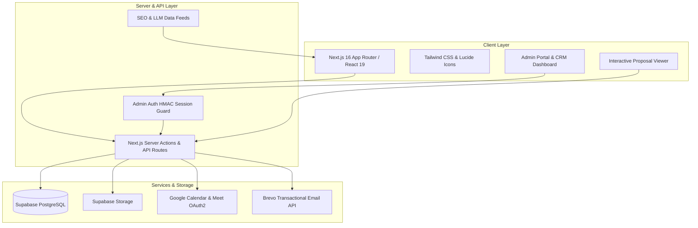

# 🚀 Digital Dude — Agency & Client Operations Platform

<div align="center">


### Enterprise-Grade Software Engineering Agency Platform & Client Operations Hub

[](https://nextjs.org/)
[](https://react.dev/)
[](https://www.typescriptlang.org/)
[](https://tailwindcss.com/)
[](https://supabase.com/)
[]()

[Live Website](https://www.digitaldude.co.uk) • [Admin Portal](https://www.digitaldude.co.uk/admin) • [Contact & Booking](https://www.digitaldude.co.uk/contact)

</div>

---

## 📖 Overview

**Digital Dude** is an all-in-one agency website, CRM, proposal delivery engine, and client portal built for modern software consulting, custom SaaS, CRM, and cloud product development.

The system combines a customer-facing digital agency experience with a secure, backend operations hub:
- **Agency Marketing & SEO Engine:** High-converting landing pages, services, industry verticals, interactive case studies, and blog.
- **Client Proposal Delivery:** Dynamic, interactive project briefs and proposals with milestones, scope, pricing tiers, and direct acceptance flow.
- **Agency CRM & Pipeline:** End-to-end deal management with Kanban pipeline stages, custom leads, manual outreach email composer, and value tracking.
- **Automated Scheduling:** 30-minute discovery call booking integrated directly with Google Calendar & Google Meet OAuth2.
- **Transactional & Outreach Email:** Branded HTML email communications powered by Brevo.

---

## 🌟 Key Features

### 1. 🌐 Modern Agency Front-End
- **Speed & Aesthetics:** Built on Next.js 16 App Router and React 19 with dark-mode glassmorphism and micro-animations.
- **SEO & AI Discovery:** Dynamic OpenGraph image generation (`/api/og`), auto-generated XML Sitemaps (`/sitemap.xml`), RSS Feed (`/rss.xml`), Atom Feed (`/feed.xml`), and LLM index feeds (`/llms.txt`, `/llms-full.txt`).
- **Showcases & Verticals:** Dedicated industry solutions (Logistics, Property, Travel, Recruitment, Education, Home Services) and in-depth Case Studies.

### 2. 💼 Interactive Proposals System
- **Dynamic Proposal Pages (`/proposals/[slug]`):** Shareable client proposals featuring project scopes, tech stack breakdowns, timeline deliverables, and structured pricing tiers.
- **Direct Acceptance Workflow:** One-click digital acceptance with status tracking (`draft` → `sent` → `accepted` → `completed`).
- **Access Control & Privacy:** Strict row-level and server-side policy enforcement — drafts are hidden from the public and require authenticated admin credentials.
- **Clean Document Printing:** Custom print CSS styles ensuring clean, un-cluttered PDF generation.

### 3. 📊 Full-Cycle CRM & Pipeline
- **Kanban Deal Board & Table Views:** Real-time deal stages (`new`, `contacted`, `qualified`, `proposal_sent`, `negotiation`, `closed_won`, `closed_lost`).
- **Custom Lead Creation:** Add custom inbound or outbound leads with deal value, priority, tags, and timeline notes.
- **Outreach & Communication Hub:** Send personalized emails to leads directly from the CRM with pre-configured templates (Cold Outreach, B2B Introduction, Follow-up, Proposal Delivery).

### 4. 📅 Automated Calendar & Meet Scheduling
- **Instant Booking Engine:** Prospective clients select available 30-minute slots on the `/contact` page.
- **Google Calendar OAuth2 Integration:** Automatically creates calendar events on the primary Google account, generates Google Meet conference links, and dispatches attendee invitations.
- **Conflict Prevention:** Robust database-level uniqueness enforcement on slot times.

### 5. 📝 Content Management System (CMS)
- **Case Studies & Blog Posts:** Full markdown editor with draft/published state management.
- **Supabase Storage:** Direct secure image and asset uploads.
- **Admin Stats & Telemetry:** Pipeline totals, revenue estimates, deal velocities, and booking summaries.

---

## 🏗️ Architecture & Tech Stack



| Layer | Technologies Used |
|---|---|
| **Framework** | [Next.js 16](https://nextjs.org/) (App Router, Server Components) |
| **UI Library** | [React 19](https://react.dev/), [Tailwind CSS](https://tailwindcss.com/), [Lucide React](https://lucide.dev/) |
| **Language** | [TypeScript 5](https://www.typescriptlang.org/) (Strict Mode) |
| **Database** | [Supabase](https://supabase.com/) (PostgreSQL 15+ with RLS) |
| **File Storage** | Supabase Storage Buckets |
| **Calendar Automation** | [Google Calendar API](https://developers.google.com/calendar) (OAuth2 Web Client) |
| **Email Service** | [Brevo API](https://www.brevo.com/) (Transactional & Custom Outreach) |
| **Authentication** | Custom HMAC-SHA256 Cookie Token Authentication |

---

## 📁 Project Structure

```text
digitaldude/
├── app/                              # Next.js App Router
│   ├── (marketing)/                  # Public Pages
│   │   ├── about/                    # About Digital Dude
│   │   ├── blog/                     # Agency Insights & Articles
│   │   │   └── [slug]/               # Dynamic Article View
│   │   ├── contact/                  # Contact Form & 30-min Booking
│   │   ├── how-we-work/              # Agency Process & Methodologies
│   │   ├── industries/               # Industry-Specific Landing Pages
│   │   │   ├── community/
│   │   │   ├── education/
│   │   │   ├── home-services/
│   │   │   ├── logistics/
│   │   │   ├── property/
│   │   │   ├── recruitment/
│   │   │   └── travel/
│   │   ├── services/                 # Service Offerings
│   │   │   ├── crm-development/
│   │   │   ├── erp-hrm-systems/
│   │   │   ├── marketplace-development/
│   │   │   ├── saas-development/
│   │   │   ├── seo-growth/
│   │   │   └── website-development/
│   │   └── work/                     # Case Studies Portfolio
│   │       └── [slug]/               # Dynamic Case Study View
│   ├── admin/                        # Secure Admin Portal
│   │   ├── blogs/                    # Blog Post Manager & Editor
│   │   ├── bookings/                 # Lead & CRM Pipeline Hub
│   │   ├── case-studies/             # Portfolio Case Study Manager
│   │   ├── proposals/                # Proposal Creation & Management
│   │   └── login/                    # Admin Authentication
│   ├── api/                          # Serverless API Endpoints
│   │   ├── admin/                    # Admin REST Handlers
│   │   │   ├── auth/                 # Login, Logout, Status
│   │   │   ├── bookings/             # CRM Leads CRUD & Pipeline
│   │   │   ├── case-studies/         # Case Studies API
│   │   │   ├── export-csv/           # CRM CSV Export
│   │   │   ├── posts/                # Blog Posts API
│   │   │   ├── proposals/            # Proposals CRUD API
│   │   │   ├── send-email/           # Outreach Email Dispatcher
│   │   │   ├── stats/                # Dashboard Metrics
│   │   │   └── upload/               # Asset Uploader
│   │   ├── auth/google/              # Google Calendar OAuth2 Handler
│   │   ├── availability/             # Booking Slot Availability Check
│   │   ├── book/                     # Public Appointment Booking
│   │   ├── og/                       # Dynamic OpenGraph Image Generator
│   │   └── proposals/[slug]/         # Proposal Action API (Accept)
│   ├── feed.xml/ & rss.xml/          # Dynamic RSS Feeds
│   ├── llms.txt/ & llms-full.txt/    # LLM Discovery Feeds
│   ├── proposals/[slug]/             # Client Proposal Viewer
│   ├── globals.css                   # Tailwind Design System
│   └── layout.tsx                    # Root Layout & Theme Configuration
├── components/                       # Reusable React UI Components
│   ├── admin/                        # Admin Portal & CRM Components
│   │   ├── AdminSidebar.tsx          # Navigation Bar
│   │   ├── CreateLeadModal.tsx       # New Lead Modal
│   │   ├── LeadPipelineBoard.tsx     # Kanban Board View
│   │   ├── ProposalList.tsx          # Proposal Table & Manager
│   │   └── SendEmailModal.tsx        # Custom Email Composer
│   ├── ContactForm.tsx               # Interactive Booking & Inquiry Form
│   ├── Footer.tsx                    # Site Footer
│   ├── Navbar.tsx                    # Glassmorphic Header Navigation
│   └── ProposalAcceptanceModal.tsx   # Proposal Signing Modal
├── lib/                              # Core Utility Libraries
│   ├── adminAuth.ts                  # Secure Admin Session Guard
│   ├── db.ts                         # Supabase Client & Fallbacks
│   ├── emailBrevo.ts                 # Brevo API & Email Templates
│   ├── googleCalendar.ts             # Google Calendar & Meet Integration
│   └── utils.ts                      # Helpers & Classnames
├── supabase/
│   └── migrations/                   # Database SQL Migrations
│       ├── 0001_bookings.sql         # Initial Bookings Table
│       ├── 0002_admin_and_blogs.sql  # Admin Users & Blog Posts
│       ├── 0003_storage.sql          # Asset Storage Policies
│       ├── 0004_case_studies.sql     # Case Studies Schema & Seed
│       ├── 0005_proposals.sql        # Proposals Schema & Defaults
│       ├── 0006_crm_pipeline.sql     # CRM Pipeline Columns & Enums
│       └── 0007_update_proposals_policy.sql # Security Policy Updates
├── public/                           # Static Assets & Logos
├── package.json                      # Dependencies & Scripts
├── tsconfig.json                     # TypeScript Configuration
└── next.config.js                    # Next.js Build & Redirects Config
```

---

## 🚦 Getting Started

### Prerequisites
- **Node.js**: `v20.x` or higher
- **npm**: `v10.x` or higher
- **Supabase Project**: Active Postgres database and storage bucket.

### 1. Clone & Install Dependencies
```bash
git clone https://github.com/The-Digital-Dude/digitaldude.git
cd digitaldude
npm install
```

### 2. Environment Configuration
Create a `.env.local` file in the root directory by copying the example:

```bash
cp .env.example .env.local
```

Configure your environment variables:

```env
# Site Domain
NEXT_PUBLIC_SITE_URL=https://www.digitaldude.co.uk

# Supabase Database & Storage (Server-Side Only)
SUPABASE_URL=https://your-project.supabase.co
SUPABASE_SERVICE_ROLE_KEY=your-supabase-service-role-key

# Email Dispatcher (Brevo)
BREVO_API_KEY=xkeysib-your-brevo-api-key
CONTACT_NOTIFY_EMAIL=info@digitaldude.co.uk

# Google Calendar & Google Meet OAuth2
GOOGLE_OAUTH_CLIENT_ID=your-google-client-id.apps.googleusercontent.com
GOOGLE_OAUTH_CLIENT_SECRET=your-google-client-secret
GOOGLE_OAUTH_REDIRECT_URI=http://localhost:3000/api/auth/google/callback
GOOGLE_OAUTH_SETUP_KEY=choose-a-secure-random-token
GOOGLE_OAUTH_REFRESH_TOKEN=your-generated-refresh-token
GOOGLE_CALENDAR_ID=primary
NEXT_PUBLIC_GOOGLE_APPOINTMENT_URL=https://calendar.app.google/your-appointment-id

# Admin Authentication
ADMIN_PASSWORD=your-secure-admin-password
ADMIN_SECRET_KEY=your-32-character-random-secret-key
```

### 3. Database Migrations
Run the SQL migrations inside your Supabase project (via Supabase SQL Editor or Supabase CLI):

1. `supabase/migrations/0001_bookings.sql`
2. `supabase/migrations/0002_admin_and_blogs.sql`
3. `supabase/migrations/0003_storage.sql`
4. `supabase/migrations/0004_case_studies.sql`
5. `supabase/migrations/0005_proposals.sql`
6. `supabase/migrations/0006_crm_pipeline.sql`
7. `supabase/migrations/0007_update_proposals_policy.sql`

### 4. Connect Google Calendar OAuth2 (One-Time Setup)
1. Go to [Google Cloud Console](https://console.cloud.google.com/) and create an OAuth 2.0 Client ID (Web Application).
2. Set Authorized Redirect URI: `http://localhost:3000/api/auth/google/callback` (or your production URL).
3. Start the dev server (`npm run dev`).
4. In your browser, navigate to:
   ```text
   http://localhost:3000/api/auth/google?key=<YOUR_GOOGLE_OAUTH_SETUP_KEY>
   ```
5. Authorize the Google account that should host the meetings.
6. Copy the returned `refresh_token` into `GOOGLE_OAUTH_REFRESH_TOKEN` in your `.env.local`.

---

## 🛠️ Development Scripts

| Command | Action |
|---|---|
| `npm run dev` | Start the local Next.js development server at `http://localhost:3000` |
| `npm run build` | Compile optimized production build (`next build --webpack`) |
| `npm run start` | Run the Next.js production server |
| `npm run typecheck` | Run static TypeScript compiler validation (`tsc --noEmit`) |
| `npm run lint` | Run Next.js code analysis and linting |

---

## 🔒 Security & Data Integrity

- **Fail-Closed Operations:** Database writes in API routes fail closed without unverified optimistic responses.
- **Service Role Isolation:** `SUPABASE_SERVICE_ROLE_KEY` is strictly confined to server-side routes and never exposed to client bundles.
- **Proposal Access Controls:** Proposals in `draft` status are strictly hidden from public links unless accessed by an authenticated admin session.
- **Timing-Safe Auth:** Admin login uses crypto-grade hash and timing-safe comparisons to prevent timing attacks.

---

## 📄 License & Ownership

Private and proprietary. All rights reserved © **Digital Dude**.
Website: [https://www.digitaldude.co.uk](https://www.digitaldude.co.uk)
